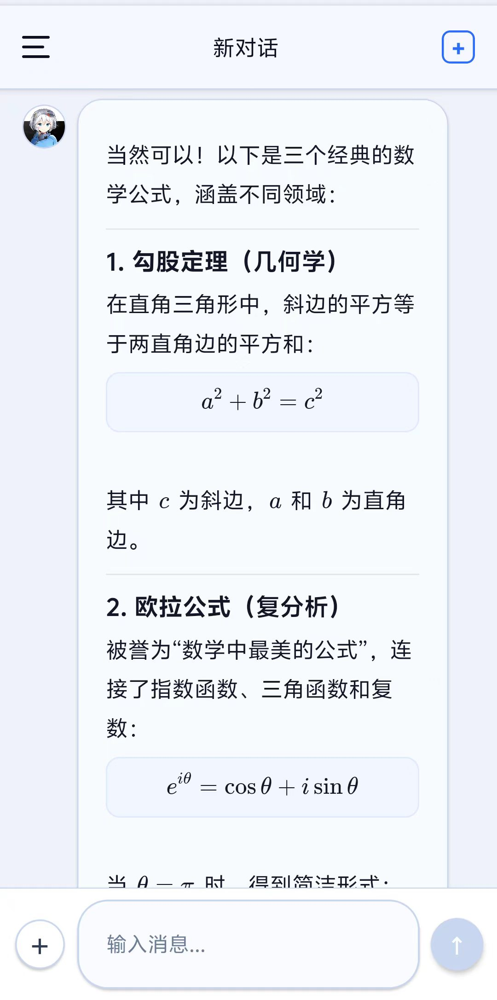
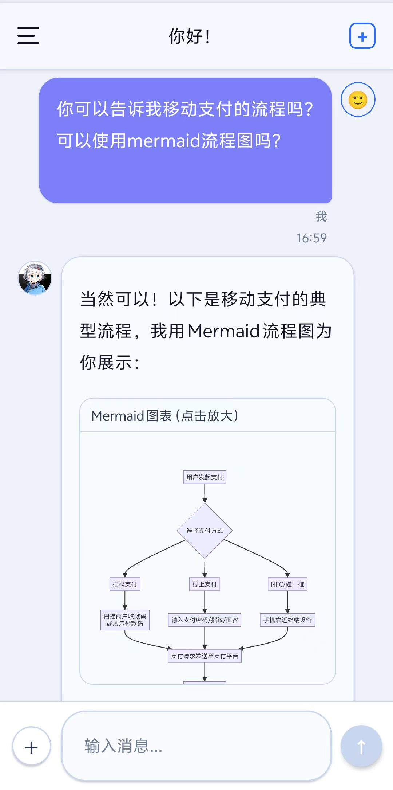
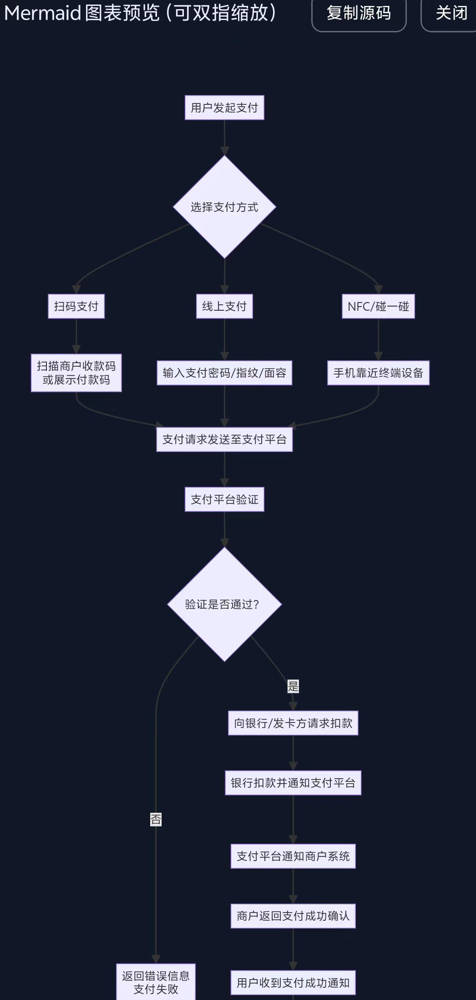
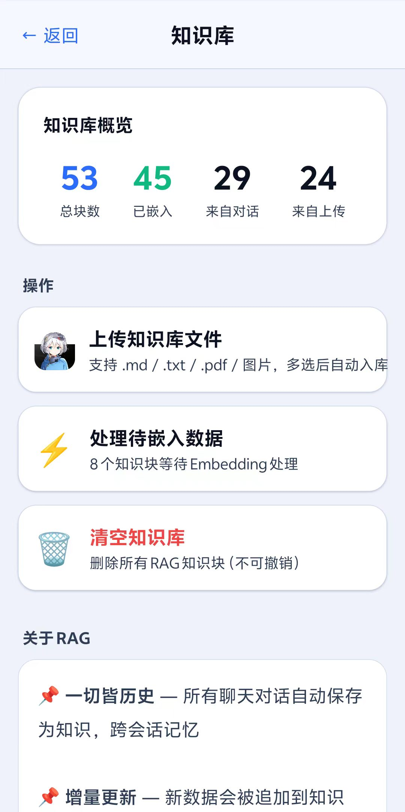
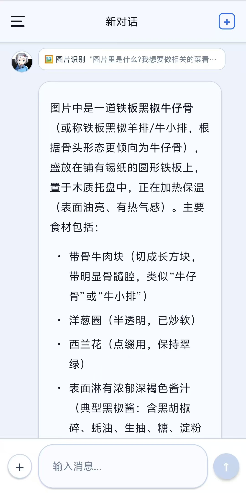

<div align="center">
  
  <h1>随身AI助手 (AI-Assistant-Anywhere)</h1>
  <p>一个全功能 AI 助手应用 — 一切皆历史 · 联网搜索 · AI绘图</p>

  <p>
    
    
    
    
    
  </p>
</div>

---

## 🧭 核心宗旨：一切皆历史 (Philosophy)

**一切皆历史**：你说过的、你看过的、你上传的，都会成为未来可检索、可引用、可更新的“历史”。
这个项目的目标不是堆叠“API/Agent/RAG”名词，而是把 **历史** 做成一等公民：

- **对话是历史**：每次对话都可以沉淀为长期记忆（本地存储），跨会话持续生效。
- **上传是历史**：你导入的文本/PDF/图片会进入知识库，变成可检索的背景知识。
- **输出也是历史**：AI 的回答会回写到本地，后续可导出备份、迁移到新设备。

为实现这条宗旨，应用采用 **React Native + Expo Router**，并把「流式对话」「多模态理解」「工具调用」「多层记忆」编排进同一条消息管线：一边输出一边渲染，同时保证移动端体验稳定、顺滑。

你可以把它当作一个可二次开发的“移动端 AI 操作系统雏形”（但请记住：**历史优先**）：

- **历史的获取方式**：多层记忆（感性/理性/历史/通用）加权检索，把“该记住的”在需要时取出来。
- **历史的表达方式**：Markdown、LaTeX、Mermaid 支持实时渲染、点击全屏预览、复制源码。
- **历史的更新方式**：对话后异步写入/增量更新，尽量不阻塞 UI 热路径。

> 说明：API 兼容、Agent 调度、RAG 检索等都属于实现手段；你可以替换模型供应商，但“历史是一切”的体验不变。

代码结构（建议从这里开始读）：

- `app/`：Expo Router 页面入口
- `src/store/index.ts`：消息管线与运行时编排（端到端 `sendMessage`）
- `src/services/`：Agent、RAG、搜索、绘图、语音等服务模块

## 📱 核心功能演示 (Live Demo)

<div align="center">
  
  <p><em>应用实际运行演示（对话、多模态、工具调用全流程）</em></p>
</div>

---

## 📸 应用截图展示 (App Screenshots)

<div align="center">
  <table>
    <tr>
      <td align="center"><br/><b>图片理解：拍照/截图提问</b></td>
      <td align="center"><br/><b>Markdown + LaTeX 实时渲染</b></td>
      <td align="center"><br/><b>Mermaid：对话内渲染</b></td>
    </tr>
    <tr>
      <td align="center"><br/><b>Mermaid：全屏预览/缩放</b></td>
      <td align="center"><br/><b>知识库：上传/嵌入/统计</b></td>
      <td align="center"><br/><b>图片理解：结构化识别结果</b></td>
    </tr>
  </table>
</div>

---

## ✨ 功能概览 (Features)

- **🧾 核心宗旨：一切皆历史**：对话/知识库/配置全部本地持久化，支持导入导出与备份恢复，让记忆跨会话延续。
- **💬 AI 对话**：流式响应，支持 DeepSeek / 通义千问 / Kimi / GLM / GPT 等所有兼容 OpenAI 格式的模型。
- **🧠 多层 RAG 记忆**：感性层（情感分析）+ 理性层（用户画像）+ 历史层（对话记忆）+ 通用知识库。
- **🌐 联网搜索**：Agent 自主判断是否需要搜索，使用 DashScope Qwen `enable_search` 获取实时信息。
- **🎨 AI 绘图**：Agent 自主判断是否需要画图，阿里云 DashScope 文生图。生图前先由 LLM 自动优化提示词。
- **👁️ 图片理解**：支持多模态模型（通义千问 VL 等），可在设置中选择视觉识别模型。
- **📎 文件附件对话**：聊天输入支持多图片 + 多文件混合发送（文本文件自动提取节选用于上下文）。
- **📐 数学公式渲染**：支持 LaTeX 块级公式（`$$...$$` / `\[...\]`）正确排版显示，全屏预览支持复制源码。
- **📊 Mermaid 图表渲染**：支持 Mermaid 代码块直接渲染，点击可全屏预览并双指缩放，支持复制源码。
- **💾 生图下载**：生成后的图片支持在消息气泡中一键保存到本地。
- **🔄 图片+联网同回合**：图片理解与联网搜索可在同一轮自动串联（先看图，再检索，再综合回答）。
- **⏰ 时间工具**：内置时间函数（当前时间/日期/星期/时间戳），并为模型注入“当前时间锚点”。
- **📚 知识库管理**：上传文本 / PDF / 图片构建本地知识库，支持按类型配置向量模型（文本/非文本双路）。
- **📦 数据导入导出**：完整的对话、知识库备份与恢复。
- **🗑️ 会话批量删除**：侧栏支持编辑模式、多选/全选后批量删除。
- **🛡️ 统一错误处理**：全局 ErrorHandler 统一日志结构（预留 Sentry 接入）。
- **⚙️ 接入与版本配置**：统一维护端点、版本与路径构造，便于迁移与二次开发。
- **🌙 暗色主题**：自动跟随系统或手动切换。

---

## 🖥 环境支持 (Environment Support)

| 平台 | 支持状态 | 备注 |
|------|---------|------|
| **Android** | ✅ 支持 | 推荐 Android 10.0 及以上版本 |
| **iOS** | 🚧 实验性 | 核心功能可用，部分原生模块需适配 |
| **Web** | ❌ 不支持 | 依赖原生 SQLite 和文件系统 |

---

## 📦 安装与运行 (Install & Run)

### 环境要求

- Node.js 18+
- Expo CLI (`npm install -g expo-cli`)
- Android Studio (用于 Android 构建) 或 iOS 开发环境

### 启动步骤 (本地预览)

```bash
# 1. 克隆项目
git clone <repo-url>
cd telephone_ai_anywhere

# 2. 安装依赖
npm install

# 3. 启动开发服务器
npx expo start
```

> **💡 提示**：启动后，推荐使用手机下载 **Expo Go** App 扫描终端中的二维码进行实时预览。本项目主要依赖云端构建，未进行本地原生编译（`run:android`）的深度测试。

---

## 🔨 使用指南 (Usage)

在应用的 **设置** 页面中配置以下 Key 即可开始使用：

1. **对话模型 API Key**（必需）：任意 **OpenAI 兼容 Chat Completions** 的 Key/端点均可接入（可替换供应商或自建网关）。
2. **DashScope API Key**（可选但强烈建议）：用于 Embedding（知识库/记忆检索）、语音识别、图片生成、联网搜索、图片理解。
3. **其他 Provider Key**：预留字段（可按你的接入需求扩展）。

> **💡 提示**：当前“联网检索/Embedding/生图”等能力默认复用 DashScope Key；你也可以按需求替换为其他实现。

---

## 🏗 核心架构 (Architecture)

### 数据流向

```text
用户输入（文字 / 语音 / 图片 / 通话）
              │
              ▼
  ┌───────────────────────────────────┐
  │          Zustand Store            │
  │   消息管理 · 状态编排 · 持久化      │
  └──────────┬────────────────────────┘
             │
    ┌────────┴────────┐
    ▼                 ▼
 RAG 专员          AI Agent
(多层记忆检索)    (工具调度引擎)
    │                 │
    │           ┌─────┼─────┐
    │           ▼     ▼     ▼
    │       联网搜索  绘图   直接回复
    │      (DashScope) (阿里云)
    │                 │
    └────────┬────────┘
             ▼
      DeepSeek / 其他 LLM
      (流式输出 · XHR · 自动重试)
             │
             ▼
       消息气泡渲染
       (Markdown · LaTeX · Mermaid · 图片 · 搜索引用)
```

### 多层 RAG 记忆系统

| 层级 | 说明 | 更新策略 |
|------|------|---------|
| **感性层 (emotional)** | 分析用户情感状态和态度 | 每次对话后更新，滚动保留最近 10 条 |
| **理性层 (rational)** | 构建用户画像（兴趣/专业/风格） | 累积足够消息后整体重写 |
| **历史层 (historical)** | 所有对话的长期记忆 | 每次对话后追加 |
| **通用层 (general)** | 用户上传的知识库文档 | 手动上传文本 / PDF / 图片 |

### 架构文档

详细的架构设计请参考以下文档：
- [架构总览 (Architecture Overview)](架构文档/log7_architecture_overview.md)
- [消息管线 (Message Pipeline)](架构文档/log8_message_pipeline.md)
- [Agent 路由 (Agent Routing)](架构文档/log9_agent_routing.md)
- [RAG 架构 (RAG Architecture)](架构文档/log10_rag_architecture.md)
- [流式状态 (Streaming State)](架构文档/log11_streaming_state.md)
- [数据流与错误处理 (Dataflow Errors)](架构文档/log12_dataflow_errors.md)

---

## ⌨️ 开发与构建 (Development)

### 技术栈

- **框架**: React Native (Expo SDK 54)
- **导航**: Expo Router 6
- **状态管理**: Zustand
- **数据库**: expo-sqlite (SQLite)
- **流式传输**: XMLHttpRequest SSE (React Native 兼容)
- **富文本渲染**: react-native-markdown-display, react-native-webview (KaTeX / Mermaid)

### 构建与打包 (推荐云端构建)

本项目强烈推荐使用 **Expo EAS (Expo Application Services)** 进行云端构建，这也是作者验证通过的标准流程：

1. 将代码推送到你的 GitHub 仓库。
2. 登录 [Expo 控制台](https://expo.dev/)，创建项目并关联该 GitHub 或 FORK 仓库。
3. 在 Expo 网页端选择对应分支（如 `main`），使用 `preview` profile 触发 Android 构建。
4. 构建完成后，直接扫码或下载 APK 安装到手机即可。

*附：其他构建命令行构建参考（需自行配置对应环境）*

```bash
# EAS 云端构建 (命令行触发)
eas build -p android --profile preview

# 本地 release APK (需完善的 Android Studio 环境，未深度测试)
npm run build:apk:local
```

---

## 📄 许可证与声明 (License & Disclaimer)

### 许可证

本项目采用 **GNU General Public License v3.0 (GPL-3.0)** 许可证。这意味着你可以自由使用、修改、分发本软件，但任何基于本软件的衍生作品也必须以 GPL-3.0 协议开源。详情请参阅 [LICENSE](LICENSE) 文件。

### 数据与隐私

- **数据存储**：所有对话记录、知识库向量、用户配置均**仅存储在用户设备本地**，开发者无法访问任何用户数据。
- **API密钥**：用户自行配置的 API 密钥仅保存在本地，请求直接从设备发往相应服务商，不经过任何中转服务器。

### 免责声明

本软件按“现状”提供，不附带任何明示或暗示的保证。用户需自行承担使用本软件的全部风险。开发者不对任何因使用本软件造成的直接或间接损失承担责任。本项目使用的第三方 API 服务由相应服务商提供，开发者不对其服务可用性、准确性及合规性负责。本软件不得用于任何违反法律法规的目的。

