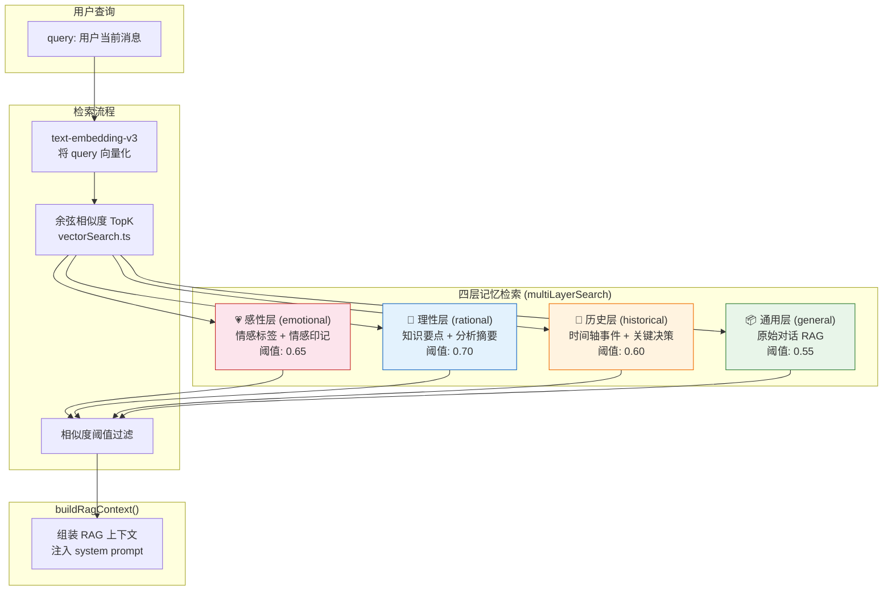
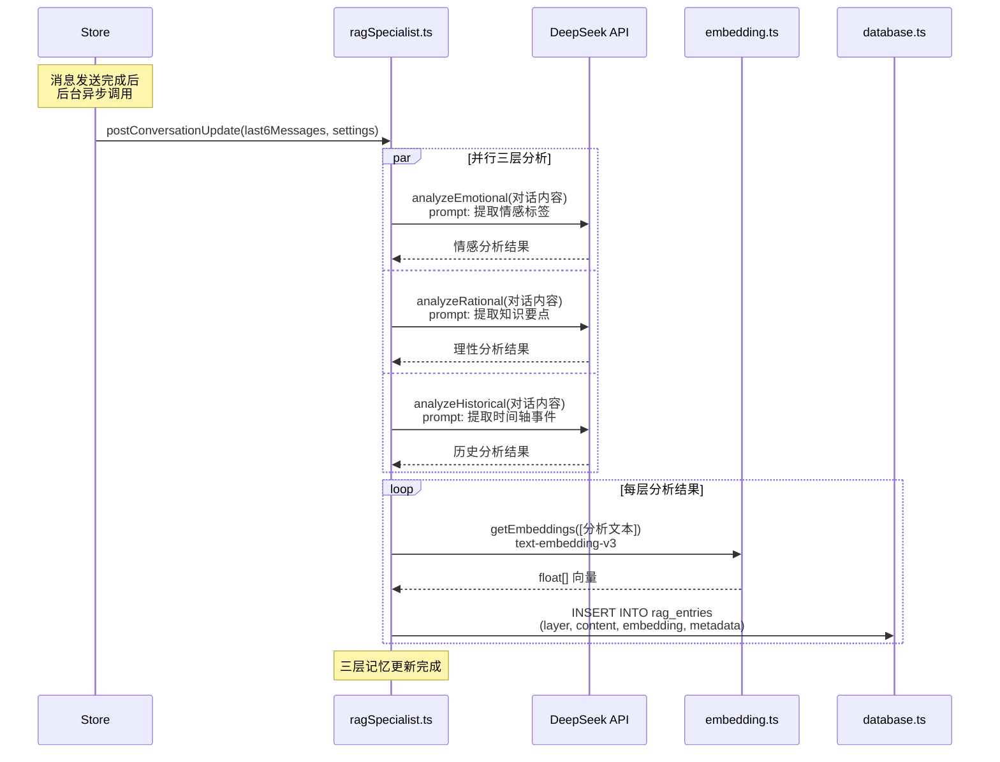
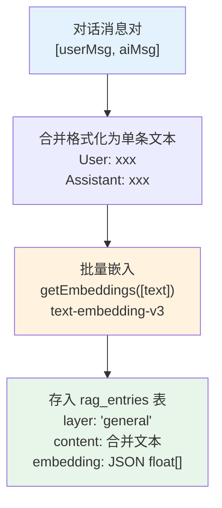
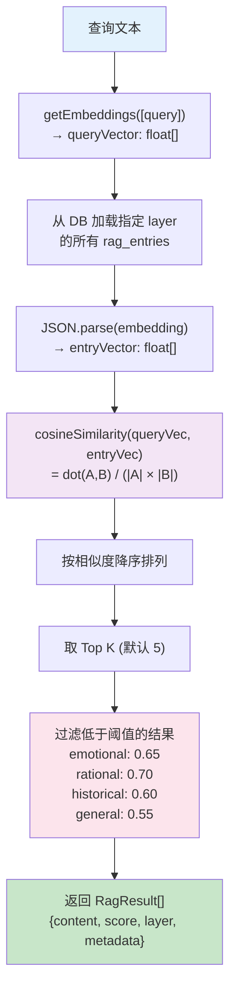
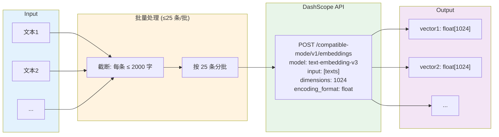
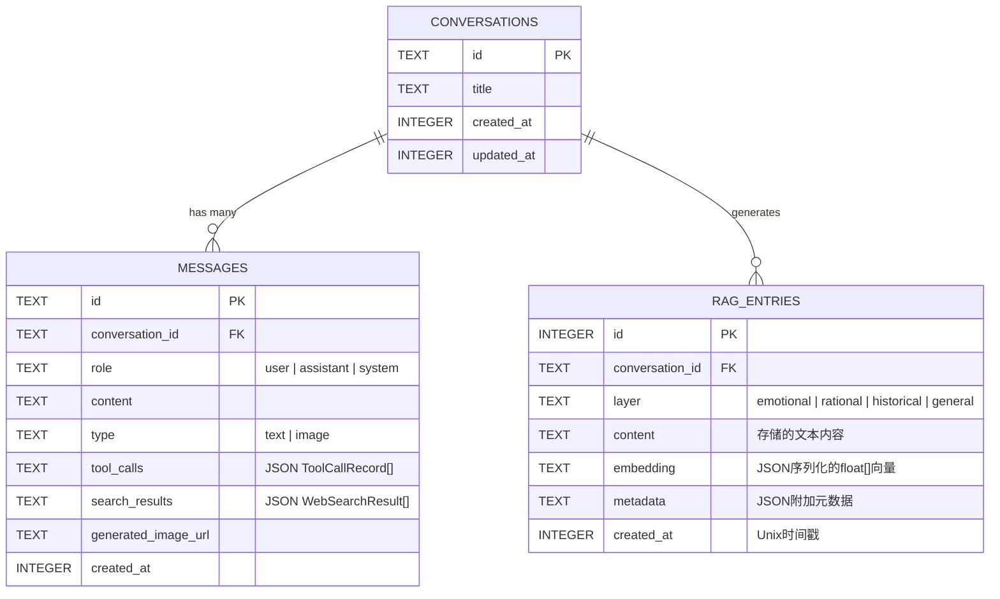

# 📚 多层 RAG 记忆架构

> ragSpecialist.ts + rag.ts + embedding.ts + vectorSearch.ts + database.ts

---

## 1. 四层记忆系统总览

---

## 2. 对话后处理更新流程 (postConversationUpdate)

---

## 3. 基础 RAG 存储流程 (addChatToRag)

---

## 4. 向量检索详解

---

## 5. Embedding 服务架构

---

## 6. 数据库 RAG 表结构

