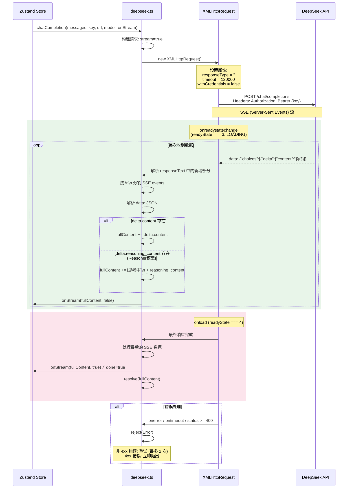
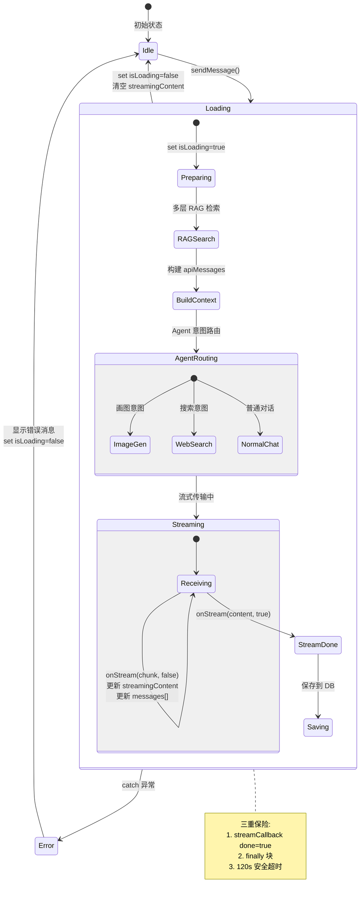
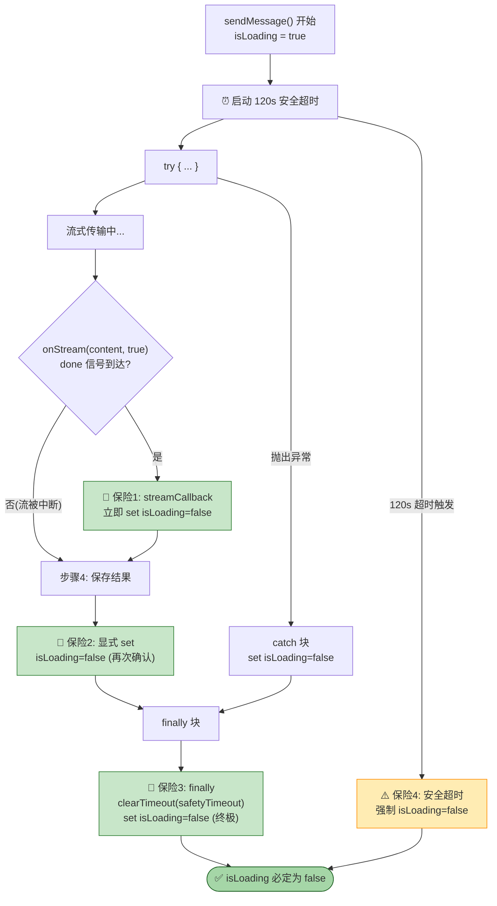
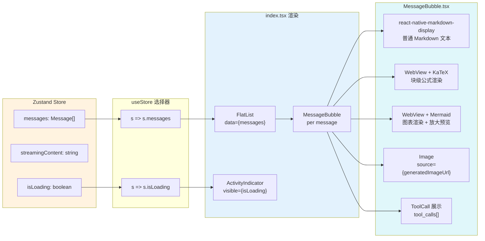
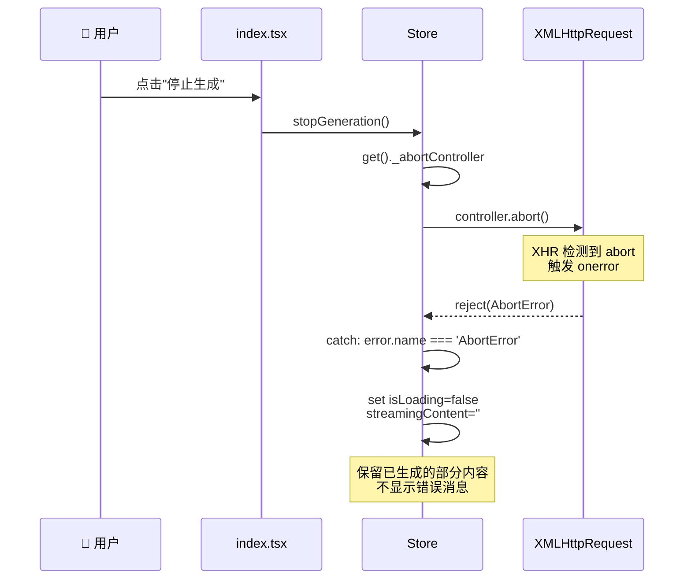

# 🌊 流式传输与状态管理

> V2.0：XHR SSE 解析 + Zustand 状态更新 + React 重渲染链路（含节流刷新与多重保险）

---

## 1. XHR SSE 流式架构 (deepseek.ts)

---

## 2. Zustand 状态流转

---

## 3. isLoading 控制策略 (三重保险)

### 3.1 流式 UI 更新节流（新增）

- `streamCallback` 仍保持 `onStream(chunk, done)` 语义不变。
- 为降低 Android 真机在长回复时的重渲染压力，Store 现在对消息气泡更新做了约 `66ms` 的节流刷新。
- `done=true` 不节流，立即 flush 到 UI，并立刻清理 `isLoading`，保证“完成即停”。
- `finally` 会额外清理节流定时器，避免会话结束后残留异步更新。

---

## 4. React 组件数据绑定

---

## 5. AbortController 取消流程

