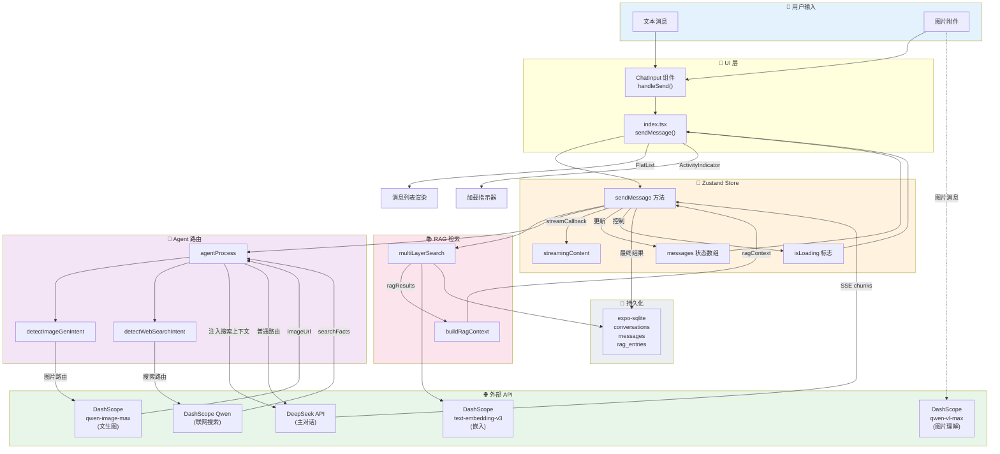
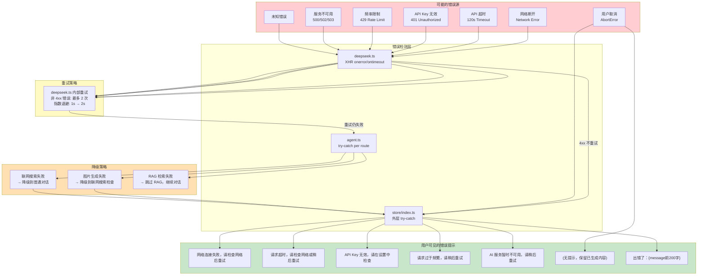
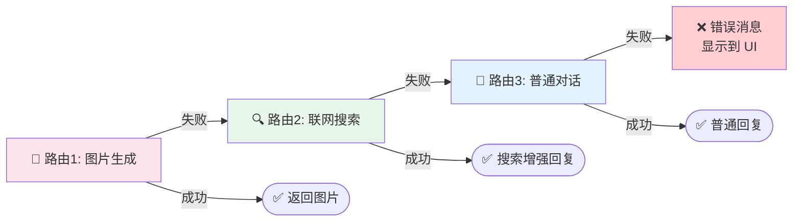
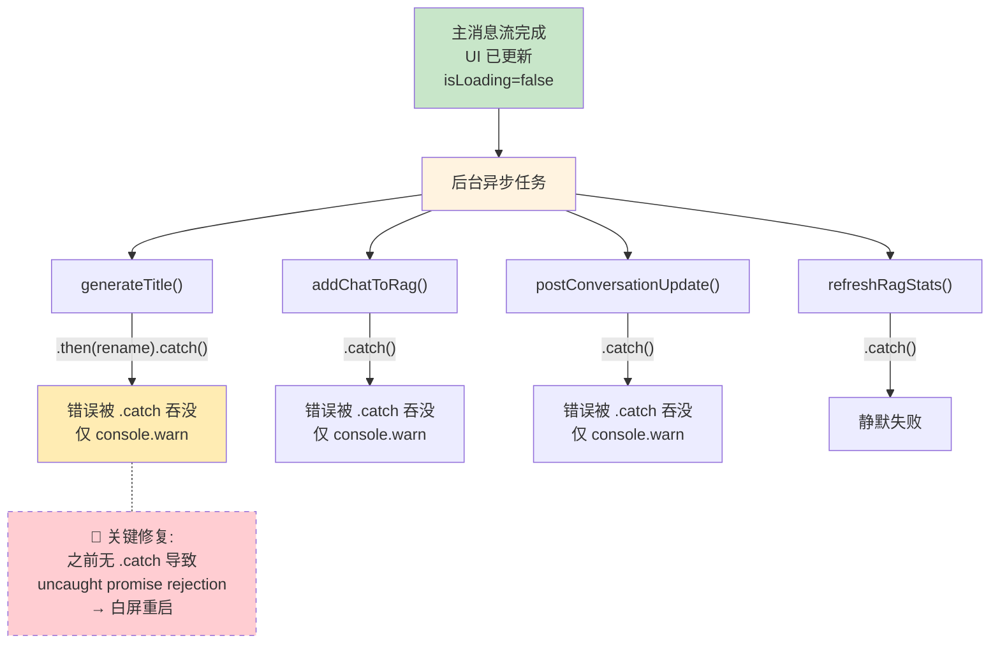
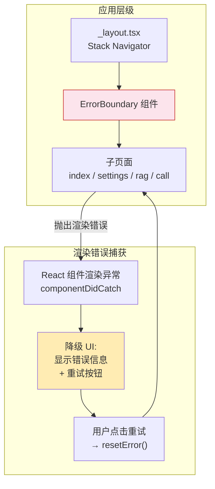
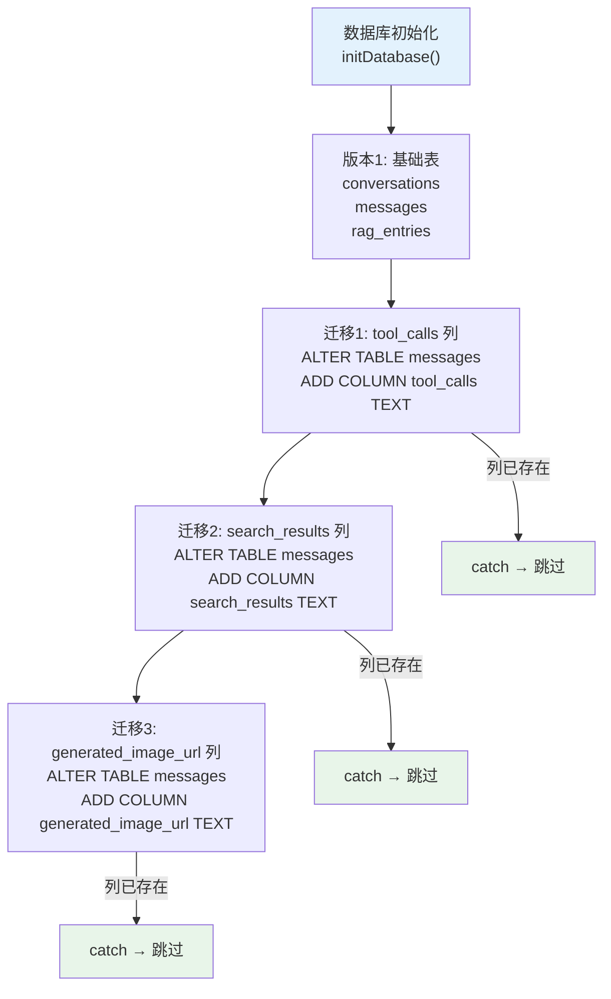

# 🛡️ 数据流、错误处理与控制策略

> 全链路数据流转 + 错误恢复 + 降级策略

---

## 1. 端到端数据流总览

---

## 2. 错误处理与降级策略

---

## 3. Agent 路由降级链

---

## 4. 后台任务错误隔离

---

## 5. ErrorBoundary 防御层

---

## 6. 数据库迁移策略

---

## 7. API 调用矩阵

| 操作 | 服务 | 端点 | 模型 | 流式 | 重试 |
|------|------|------|------|------|------|
| 主对话 | DeepSeek | /chat/completions | deepseek-chat/reasoner | ✅ SSE | 2次 |
| 标题生成 | DeepSeek | /chat/completions | deepseek-chat | ❌ | 0次 |
| 联网搜索 | DashScope | /compatible-mode/v1/chat/completions | qwen-plus | ❌ | 0次 |
| 图片生成 | DashScope | /api/v1/services/aigc/multimodal-generation/generation | qwen-image-max | ❌ | 0次(有轮询) |
| 图片理解 | DashScope | /compatible-mode/v1/chat/completions | qwen-vl-max | ✅ SSE | 0次 |
| 文本嵌入 | DashScope | /compatible-mode/v1/embeddings | text-embedding-v3 | ❌ | 0次 |
| RAG分析 | DeepSeek | /chat/completions | deepseek-chat | ❌ | 0次 |
