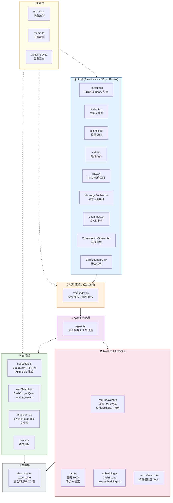
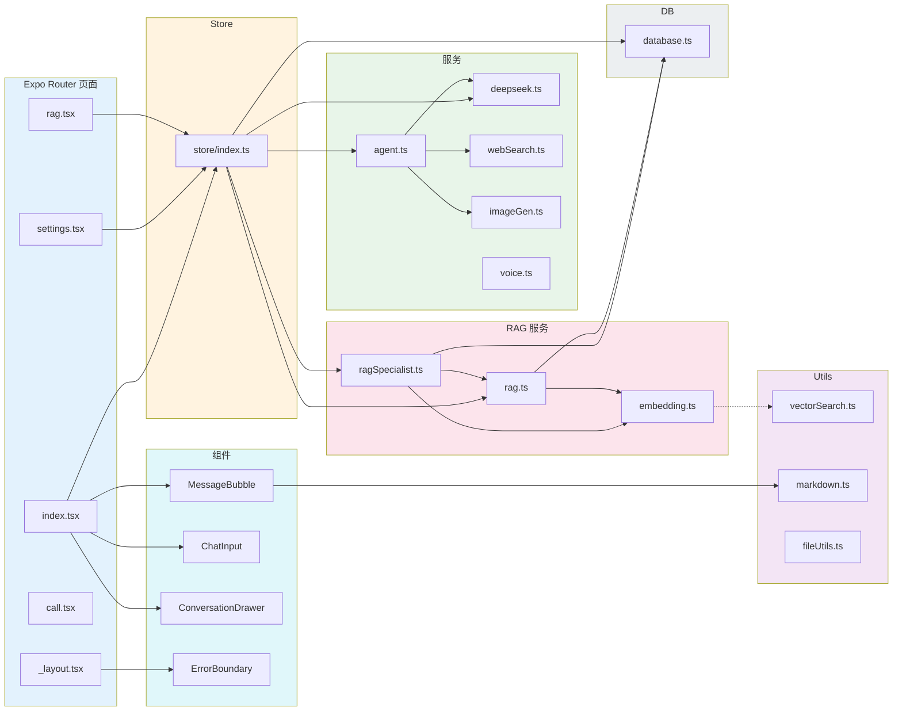

# 📐 项目总体架构图

> 生成时间：2025 年 · 基于当前代码库分析

---

## 1. 系统分层架构

---

## 2. 文件 / 模块依赖关系

---

## 3. 技术栈清单

| 层级 | 技术 | 用途 |
|------|------|------|
| 框架 | React Native + Expo SDK 54 | 跨平台移动应用 |
| 路由 | Expo Router (文件系统路由) | 页面导航 |
| 状态 | Zustand | 全局状态管理 |
| 数据库 | expo-sqlite | 本地 SQLite 持久存储 |
| LLM | DeepSeek API (OpenAI 兼容) | 主对话模型 |
| 搜索 | Aliyun DashScope (Qwen + enable_search) | 联网搜索增强 |
| 图片 | Aliyun DashScope (qwen-image-max) | AI 文生图 |
| 嵌入 | Aliyun DashScope (text-embedding-v3) | 文本向量化 |
| 视觉 | Aliyun DashScope (qwen-vl-max) | 图片理解 |
| 流式 | XHR + SSE 手动解析 | 流式对话 (RN 不支持 ReadableStream) |
| Markdown | react-native-markdown-display | AI 回复渲染 |
| 语音 | expo-speech / expo-av | TTS / STT |
