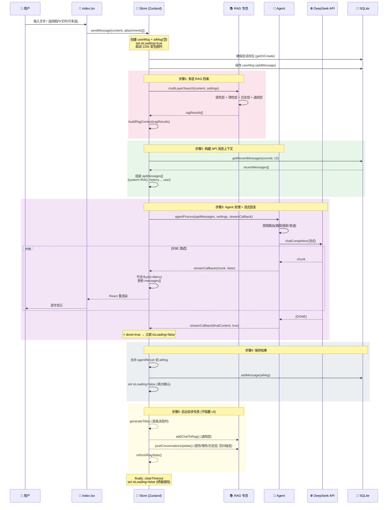
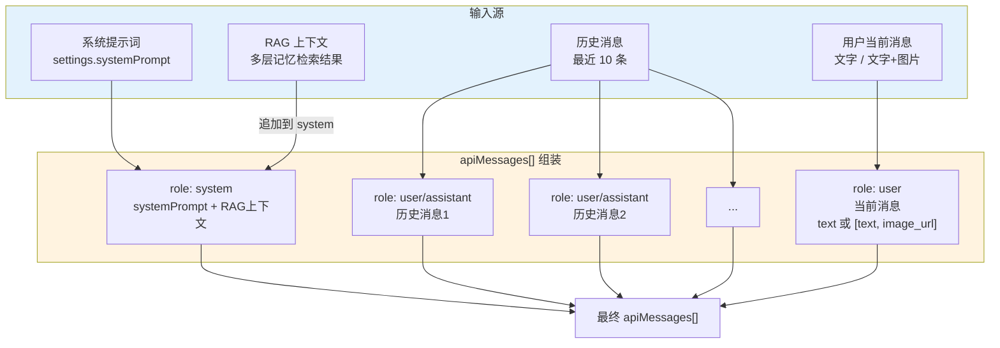
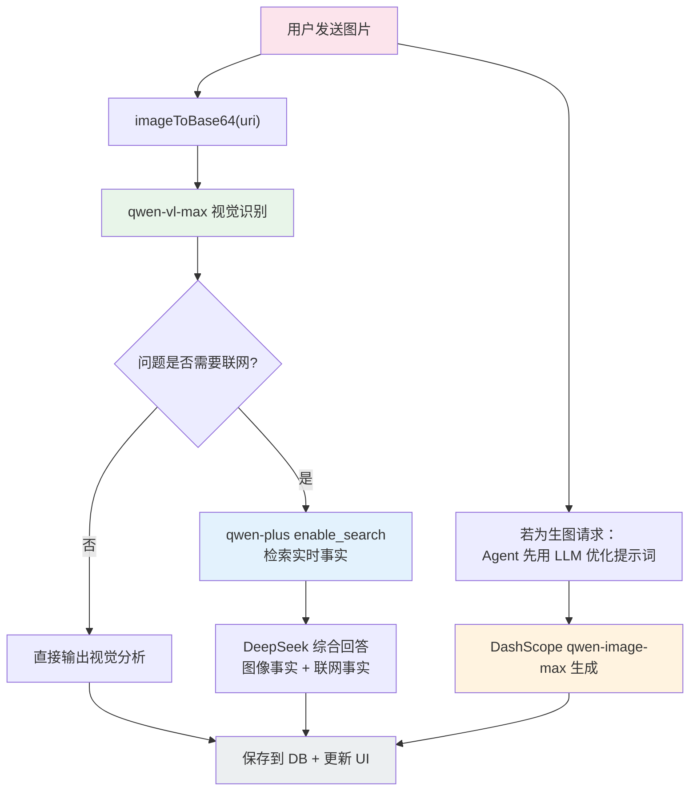

# 🔄 消息处理管线 (Message Processing Pipeline)

> V2.0：从用户输入到 AI 回复完整落盘的全链路（含多附件、流式节流与真机稳定性策略）

---

## 1. 完整消息生命周期

---

## 2. API 消息组装详情

---

## 3. 图片消息特殊处理流程（新版）

---

## 6. 增量更新（文件附件 + 聊天交互）

### 6.1 输入能力升级

- `ChatInput` 从“单附件”扩展为“多图片 + 多文件附件”。
- 文件附件会在本地保存，并尝试读取文本内容节选（txt/md/json/csv/log/xml/yaml 等）。
- `sendMessage` 新增 `attachments[]` 参数，统一承载混合附件并注入 `apiMessages`。

### 6.2 数据模型与持久化升级

- `Message` 新增字段：`attachments[]`（保留旧字段 `imageUri/fileUri` 兼容老数据）。
- `messages` 表新增列（向后兼容迁移，`ALTER TABLE ... try/catch`）：
    - `attachments_json`

### 6.3 聊天页交互改进

- 修复消息区与输入区之间的视觉空白问题（消息列表占满可用高度）。
- 新增“从屏幕左缘右滑打开侧栏”手势。
- 输入栏改为同轴对齐布局：`+` 按钮与输入框、发送按钮垂直中心对齐。

## 7.  增量更新（同回合图片+联网 + 时间锚点）

### 7.1 图片消息组合链路

- 旧行为：图片消息固定“视觉模型直答”，会绕过 Agent 联网分支。
- 新行为：当用户在图片轮显式提出“检索/搜索/最新进展”等实时诉求时，执行三段链路：
    1. `qwen-vl-max` 先做图片识别（抽取可见事实）
    2. `qwen-plus + enable_search` 联网补充外部事实
    3. DeepSeek 基于“图像事实 + 联网事实”进行最终流式综合回答

### 7.2 时间锚点注入

- 每轮 `system prompt` 注入“当前时间锚点”（本地时间、星期、时区、Unix 时间戳）。
- 目标：降低“把当前截图误判成未来事件/伪造事件”的概率。

### 7.3 会话管理能力补齐

- 侧栏新增编辑模式，支持多选/全选后批量删除会话。
- 状态层新增 `deleteConversations(ids)`，数据库层新增对应批量删除接口。

## 8. 2026-02-13 补充（可维护性）

### 8.1 API 版本集中配置

- 新增 `src/config/api.ts`：统一维护 API 版本与端点构造。
- `deepseek/webSearch/imageGen/store` 改为从配置函数获取 URL，避免路径散落硬编码。

### 8.2 统一错误处理

- 新增 `src/services/errorHandler.ts`：
    - 统一 `reportError` 输出结构化日志
    - `toUserFriendlyMessage` 统一用户可读错误文案
    - 预留 Sentry 接入点（按需启用）

## 9. 2026-02-13 补充（稳定性与体验）

### 9.1 对话后处理降压

- `postConversationUpdate` 改为延迟触发（防抖），并扩大上下文窗口到最近 12 条消息。
- `ragSpecialist` 理性层更新频率下调，降低每轮会话结束后的瞬时计算压力。

### 9.2 生成图片闭环能力

- 消息气泡支持对 `generatedImageUrl` 一键保存到本地相册。
- 用户提问“描述刚才生成的图片”时，Store 会尝试复用上一条生图 URL 进入图像理解链路。

## 10. 2026-02-20 补充（渲染与交互）

### 10.1 富文本渲染增强

- `MessageBubble` 新增混合渲染分段：
    - 普通文本：`react-native-markdown-display`
    - LaTeX 块公式：`WebView + KaTeX`
    - Mermaid 代码块：`WebView + Mermaid`

### 10.2 Mermaid 与 LaTeX 交互体验

- Mermaid 图表支持“消息内预览卡片 + 点击全屏预览”。
- 全屏预览支持双指缩放，适配复杂图表查看。
- Mermaid 图表和 LaTeX 公式在全屏预览模式下，均支持“复制源码”功能，一键复制原始代码到剪贴板。

### 10.3 键盘与安全区适配 (Keyboard & SafeArea)

- 移除 `SafeAreaView`，改用 `useSafeAreaInsets` 手动控制 `paddingTop` 和 `paddingBottom`，避免 Android 键盘弹出时安全区计算异常导致的 UI 跳动。
- 聊天页统一使用 `KeyboardAvoidingView` 处理双端键盘避让（iOS 使用 `behavior="padding"`，Android 使用 `behavior={undefined}`）。
- 移除 `FlatList` 的 `onLayout={scrollToBottom}`，仅保留 `onContentSizeChange` 触发滚动。
- 发送后主动 `Keyboard.dismiss()`，降低部分机型（如 iQOO/MIUI/ColorOS）输入模式残留导致的底部悬空概率。

