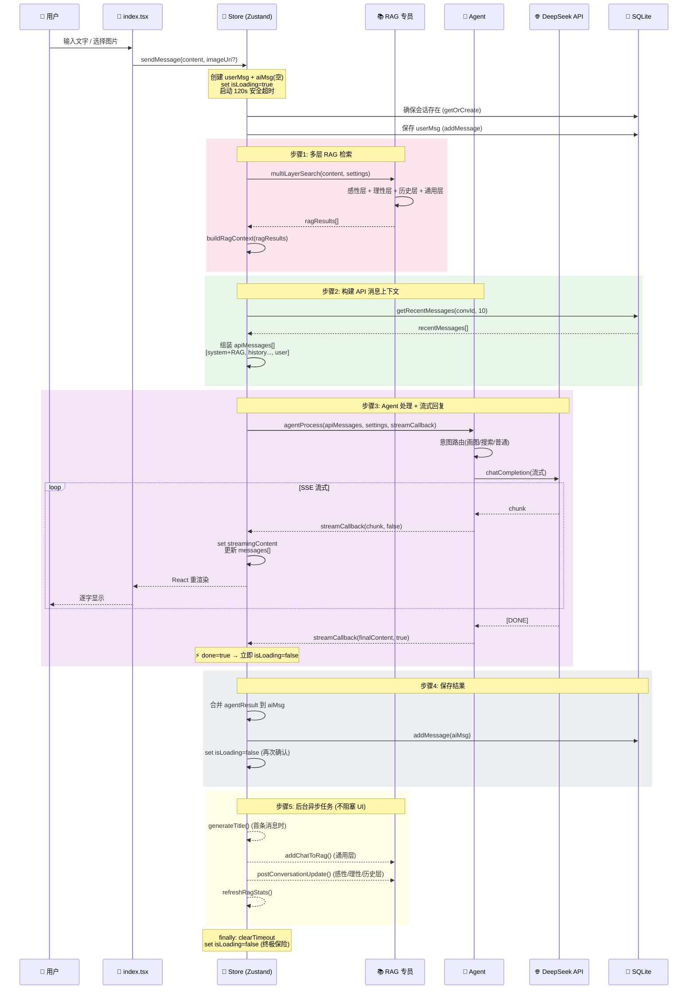
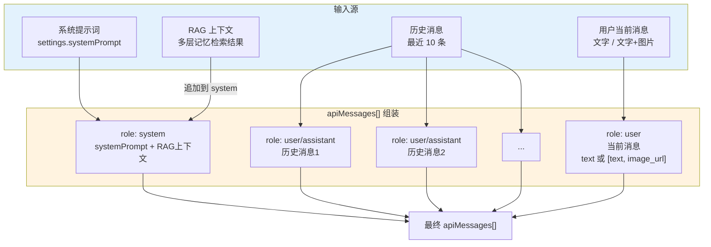
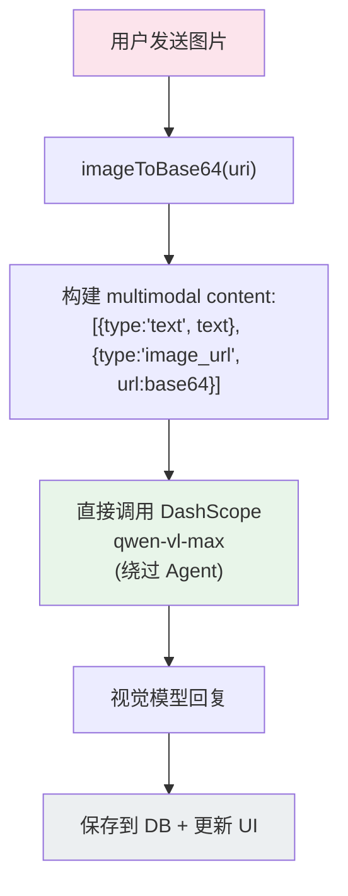

# 🔄 消息处理管线 (Message Processing Pipeline)

> 从用户输入到 AI 回复完整落盘的全链路

---

## 1. 完整消息生命周期

---

## 2. API 消息组装详情

---

## 3. 图片消息特殊处理流程

---

## 6. 2026-02 增量更新（文件附件 + 聊天交互）

### 6.1 输入能力升级

- `ChatInput` 从“仅图片”扩展为“图片 + 文件附件”。
- 文件附件会在本地保存，并尝试读取文本内容节选（txt/md/json/csv/log/xml/yaml 等）。
- `sendMessage` 新增 `type='file'` 与 `fileAttachment` 参数，文件信息会注入 `apiMessages`。

### 6.2 数据模型与持久化升级

- `Message` 新增字段：`fileUri` / `fileName` / `fileMimeType`。
- `messages` 表新增列（向后兼容迁移，`ALTER TABLE ... try/catch`）：
    - `file_uri`
    - `file_name`
    - `file_mime_type`

### 6.3 聊天页交互改进

- 修复消息区与输入区之间的视觉空白问题（消息列表占满可用高度）。
- 新增“从屏幕左缘右滑打开侧栏”手势。
- 输入栏改为同轴对齐布局：`+` 按钮与输入框、发送按钮垂直中心对齐。

