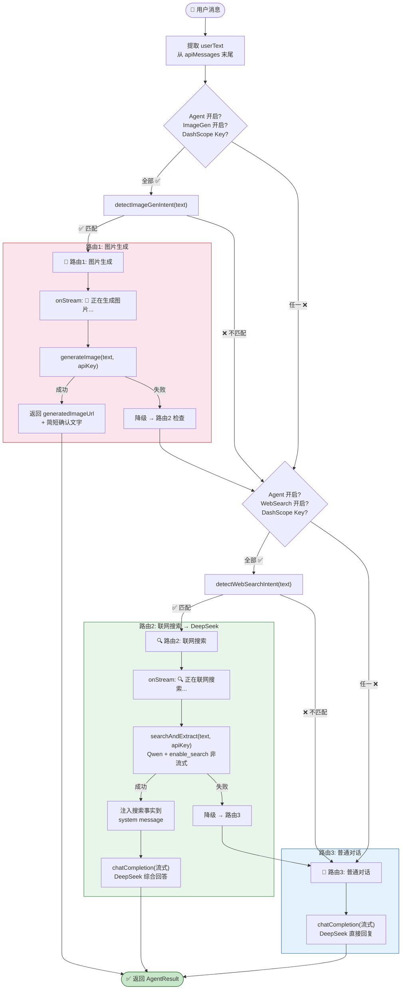
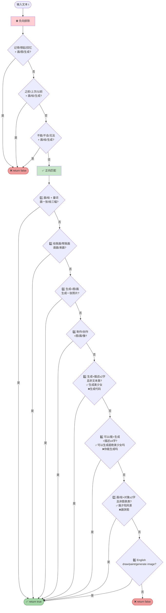
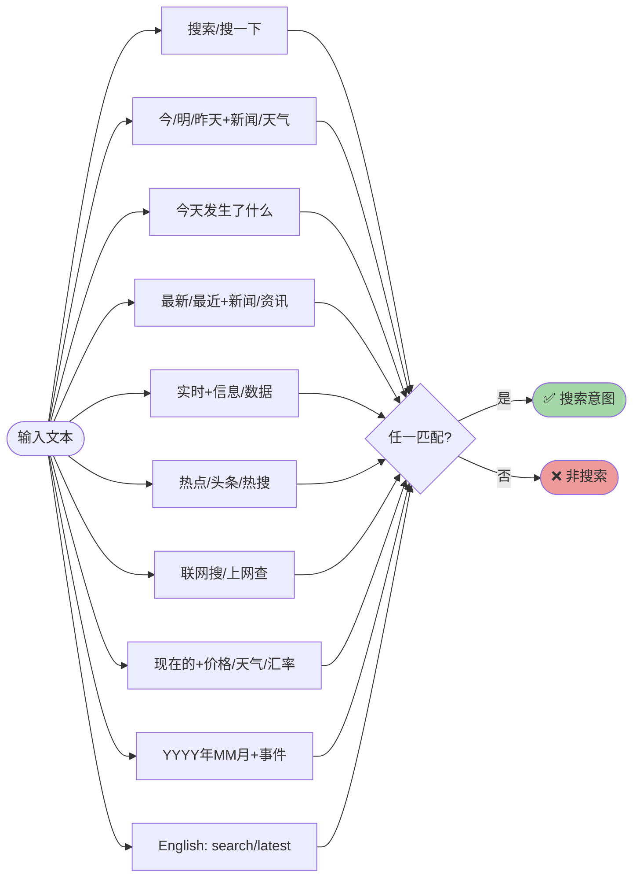
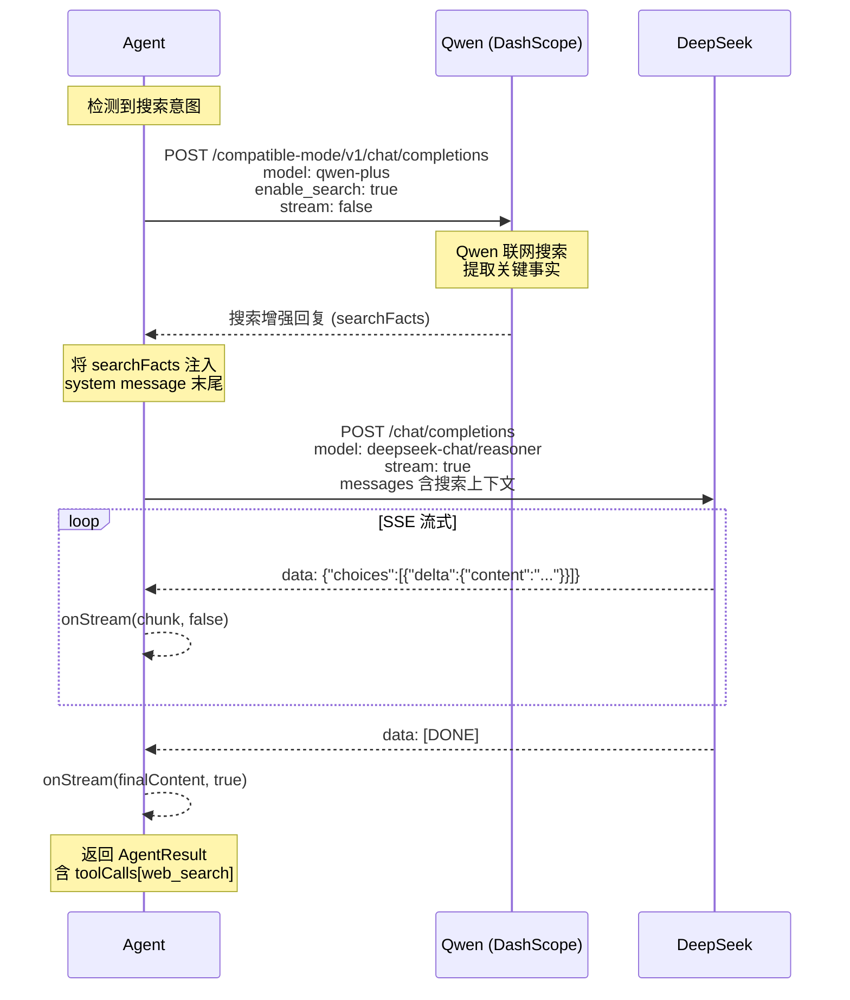
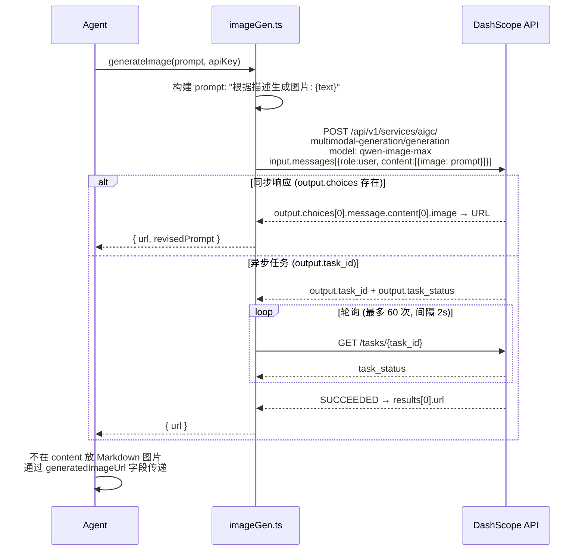

# 🤖 Agent 意图路由与工具调度

> agent.ts 的核心决策逻辑 — 关键词预路由架构

---

## 1. 三路意图路由总览

---

## 2. 图片生成意图检测规则 (detectImageGenIntent)

---

## 3. 联网搜索意图检测规则 (detectWebSearchIntent)

---

## 4. 联网搜索两步流程详解

---

## 5. 图片生成 API 调用流程

---

## 6. 2026-02 路由策略升级

### 6.1 路由决策从“规则优先”升级为“LLM 优先 + 规则兜底”

- 新增分类器决策：`image_gen | web_search | chat`
- 分类器仅负责路由，不负责内容回答
- 当分类器输出异常或置信度不足时，自动降级到原有关键词规则

### 6.2 联网搜索增强回退链路

- 主路径：`searchAndExtract(query)` 获取搜索事实
- 回退路径：若事实为空，使用 `qwenSearchChat(...)` 获取可用实时摘要
- 然后统一注入 DeepSeek 上下文进行最终流式回复

### 6.3 设计目标

- 降低误判（尤其是“是否生图”）
- 提高联网问答可用率
- 保持原有流式 `onStream(chunk, done)` 行为不变

