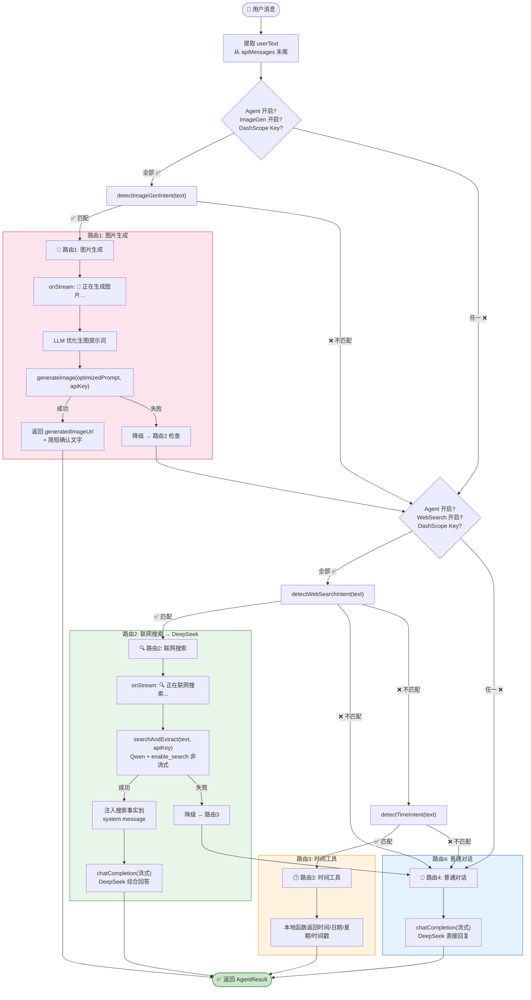

# 🤖 Agent 意图路由与工具调度

> V2.0：agent.ts 的核心决策逻辑 — LLM 路由优先 + 规则兜底

---

## 1. 四路意图路由总览

---

## 2. 图片生成意图检测规则 (detectImageGenIntent)

---

## 3. 联网搜索意图检测规则 (detectWebSearchIntent)

---

## 4. 联网搜索两步流程详解

---

## 5. 图片生成 API 调用流程

---

## 6. 路由策略说明（当前实现）

### 6.1 LLM 路由优先 + 规则兜底

- 当前 `agent.ts` 先调用 `decideRouteWithLLM` 输出 `image_gen / web_search / time_query / chat`。
- 当 LLM 路由失败或置信度不足时，降级到关键词规则：
    - `detectImageGenIntent`
    - `detectTimeIntent`
    - `detectWebSearchIntent`
- 设计目标是在保持跨模型兼容前提下，提高复杂语句的路由准确率。

### 6.2 联网搜索增强回退链路

- 主路径：`searchAndExtract(query)` 获取搜索事实
- 回退路径：若事实为空，使用 `qwenSearchChat(...)` 获取可用实时摘要
- 然后统一注入 DeepSeek 上下文进行最终流式回复

### 6.3 设计目标

- 降低误判（尤其是“是否生图”）
- 提高联网问答可用率
- 保持原有流式 `onStream(chunk, done)` 行为不变

## 7. 路由补充（时间工具 + 图片检索协同）

### 7.1 新增时间工具路由

- 新路由：`time_query`
- 触发场景：
    - “现在几点”“今天几号”“星期几”“时间戳”等
- 执行方式：
    - 不走外部模型，直接调用本地时间函数
    - 返回当前时间、日期、星期、时区、Unix 时间戳

### 7.2 图片轮与联网检索协同

- Agent 仍保持“文本轮路由决策”职责。
- 对于图片轮，由 `store` 编排组合能力：
    - 先进行视觉识别
    - 若用户问题含实时检索意图，再追加联网搜索
    - 最终交给对话模型流式综合

该设计确保：
- 不破坏现有 Agent 架构边界
- 同时支持“图片识别 + 联网搜索”在同一回合完成

### 7.3 与多附件能力的边界

- Agent 主要处理文本轮工具路由。
- 图片/文件多附件轮由 `store` 完成多模态消息拼装后再调用 Agent 或视觉链路。
- 对“描述刚生成图片”等跨轮引用请求，优先在 `store` 侧做上下文补全（复用上一条 `generatedImageUrl`）。

